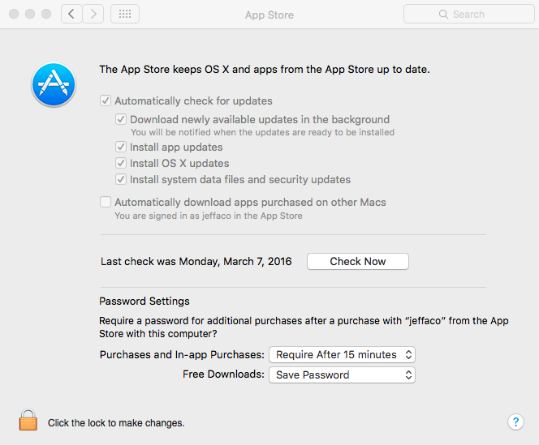

# Setting up Mac OS/X Systems

For Mac OS/X development, we use a high power Macintosh system
(currently Mac Pro), set up as an infrastructure system, to run a
number of different virtual machines (for build, development, or test
purposes).

For virtualization, we are using VMware Fusion, native on Mac OS/X.

Note that, with only a few exceptions, Mac OS/X infrastructure hosts
and Mac OS/X build/development hosts are set up identically. The
instructions below will call out the differences to minimize
maintenance to these instructions.

-----

* [Setup Instructions](#setup-instructions)
  * [Default Account](#default-account)
  * [System Updates](#system-updates)
  * [Set Up sudoers File](#set-up-sudoers-file)
  * [System Preferences](#system-preferences)
  * [Enable root Account](#enable-root-account)
  * [Set Up hostname](#set-up-hostname)
  * [Install Development Tools](#install-development-tools)
  * [Install updatedns](#install-updatedns)
  * [Install Homebrew](#install-homebrew)
  * [Install Homebrew Packages](#install-homebrew-packages)
  * [Codesign GDB](#codesign-gdb)
* [Creating a New Virtual Machine](#creating-a-new-virtual-machine)

-----

### Setup Instructions

#### Default Account

In general, the default account username is *admin* (full name:
*Administrative Account*). It is easiest to set this up during
Operating System installation, although if you set up some alternate
account, you can create the *admin* account later.

In particular, we do not use the *serviceb* account on either
infrastructure systems nor development systems. Build systems do
use *serviceb*.

User accounts (be it for an end-user, or the serviceb account) should
NOT have "Allow user to administer this computer" enabled on the
*System Preferences/Users & Groups* dialog. Instead, they should use
the sudo mechanism for sudo access as needed.

#### System Updates

Install all updates available from the *App Store* application
(available under the Apple menu from the menu bar). Note that Jeff
Coffler has created an iTunes account tied to his E-mail
(jeffcof@microsoft.com). Contact him for the password if needed.

After all updates are installed, navigate to *System Preferences/App
Store* and, for "Free Downloads:", select Save Password. Here is a
dialog to set everything properly:



These settings will automatically apply updates, and will not require
the iTunes password for each update.

#### Set Up sudoers File

After the commented out %wheel line, add a new line for %staff as follows:

```
## Same thing without a password
# %wheel ALL=(ALL) NOPASSWD: ALL
%staff ALL=(ALL) NOPASSWD: ALL
```

#### System Preferences

The follow table indicates the settings that must be changed in the
System Preferences screens:

<!-- Formatted as a table rather than markdown to allow embedded list elements -->
<table>
  <tr>
    <th>Component</th>
    <th>Setting</th>
  </tr>

  <tr>
    <td>Desktop & Screen Saver</td>
    <td>Select <i>Message</i> screen saver so, if screen saver is activated,
        it won't eat lots of CPU time to display fancy graphics.
        <br><br>
        For infrastructure system: In <i>Screen Saver</i> tab, select <i>Start after: Never</i> in pulldown. This avoids screen saver from wasting CPU time for VMs.
        <br><br>
        For virtual machines, execute the following command:<br>
          <code>sudo defaults write /Library/Preferences/com.apple.screensaver loginWindowIdleTime 0</code>
    </td>
  </tr>

  <tr>
    <td>Energy Saver</td>
    <td>
      <ul>
        <li>If you have a slider for <i>Computer sleep:</i>, set it to never</li>
        <li>Check: <i>Prevent computer from sleeping automatically</i></li>
        <li>Check: <i>Wake for network access<i></li>
        <li>Check: <i>Start up automatically after a power failure</i></li>
      </ul>
    </td>
  </tr>

  <tr>
    <td>Sharing</td>
    <td>Name system appropriately (i.e. <i>ostcdev-mac1011-01</i>).
        <br><br>
        Select:
        <ul>
          <li><i>Screen Sharing</i> (with VNC configured in <i>Computer Settings...</i>)</li>
          <li><i>Remote Login</i>
        </ul>
    </td>
  </tr>

  <tr>
    <td>Network</td>
    <td>Configure the active network interface with DHCP.</td>
  </tr>

  <tr>
    <td>App Store</td>
    <td>Check <i>Automatically check for updates</i> for all types of updates.
        <br><br>
        Do NOT check <i>Automatically download apps purchased on other Macs</i>.
    </td>
  </tr>
</table>

#### Enable root Account

This step is **NOT** needed on the infrastructure system, nor on build
servers. This is only needed on Developer and Test systems.

To enable the root account:

1. Navigate to *System Preferences / Users & Groups / Login Options*,
2. Select "Join..." at bottom right,
3. Open directory utility,
4. Unlock directory utility,
5. From menu bar for Directory Utility, select *Edit* -> *Enable root user*

#### Set Up hostname

To set up the hostname for the system, launch a command terminal and type:

```
sudo scutil --set HostName <hostname>
```

where `<hostname>` is the name of your host. Do not append scx.com to
the hostname.

#### Install Development Tools

There are two choices for development tools: `command line tools` and
`Xcode`. Because `Xcode` is quite large, we only recommend it if needed.

Command line tools are sufficent for 'git' (and thus updatedns), as
well as actually building/linking our products. Thus, we recommend the
following tools to be installed based on system type:

System Type | Development Tools
----------- | -----------------
Infrastructure | Command line tools
Build System | Command line tools
Development System | Xcode
Test System | Command line tools

To install `command line tools`, just invoke `git` from the command
line (from a GUI connection to the Mac). If the tools are not
present, you'll be prompted what to install.

Note that `Xcode` is quite large, and will take several minutes to
install. The gdb debugger only ships with `Xcode`, not the command
line tools.

#### Install updatedns

This step differs slightly based on the type of system. See
[Install Development Tools](#install-development-tools)
for guidance on what should be installed prior to installing updatedns.

* Launch a command terminal, and type:

```
git clone https://github.com/jeffaco/msft-updatedns.git updatedns
```

Once msft-updatedns is downloaded, issue the following commands:

```
cd updatedns
./updatedns.sh --configure -v
```

At this point, updatedns should run automatically and fix the DNS
resolvers to use the SCX domain servers.

#### Install Homebrew

[Homebrew][] is "the missing package manager for macOS."

Follow the installation instructions from [Homebrew][].
The short of it is reproduced here:

```sh
/usr/bin/ruby -e "$(curl -fsSL https://raw.githubusercontent.com/Homebrew/install/master/install)"
```

Next, fix the `/usr/local` directory (used by [Homebrew][]) permissions to be writable by the `staff` group:
> This is needed because Homebrew (and macOS systems in general) tend to expect single users, not groups.

```sh
sudo chgrp -R staff /usr/local
sudo chmod -R g+w /usr/local
```

[homebrew]: http://brew.sh/

#### Install Homebrew Packages

Once [Homebrew][] is installed, several [Homebrew][] packages must be
installed as well. This can be done with the following command:

```
brew install pkg-config cmake openssl
```

#### Codesign GDB

Per the Homebrew installation notes, "gdb" requires special privileges
to access machine ports.  You will need to codesign the binary. For
instructions, see:
[BuildingOnDarwin](https://sourceware.org/gdb/wiki/BuildingOnDarwin).

Since our macOS systems are shared, please check if a GDB certificate
has already been created.

Codesigning GDB needs to be done each time GDB updates, XCode updates,
or the certificate expires.

### Creating a New Virtual Machine

To create a new VM in VMware fusion, you must first download the
operating system that you wish to use (i.e. El Capitan) from the App
Store. Once downloaded, it is automatically placed in the
*/Applications/* folder, and you need to move it to make sure it won't
get installed on system reboots. Move it into the administrator's
desktop folder with a terminal by executing a command like:

```
mv /Applications/Install\ OS\ X\ El\ Capitan.app ~/Desktop
```

Once the operating to install is placed at the desktop:

* Launch VMware Fusion. This can be done via the Applications folder
via the finder, or by clicking magnifying glass on menu bar and typing
"VMware" in the spotlight window and hitting return. Note that if
VMware Fusion is already running (normally the case for virtual
machines to be running), select *Window / Virtual Machine Library*
from the menu bar once VMware Fusion is selected,
* Select *Add* (+v) from the upper left of the window,
* Drag *Install OS X El Capitan* from your desktop to the "Install
from disk or image" section of the "Select the installation Method"
window,
* Click "Continue" from the "Create a New Virtual Machine" confirmation
window.

At this point, follow the standard instructions to configure the
virtual machine from the top of this document.

Suggested hard drive sizes for virtual machines:

Machine Type | Size
------------ | ----
Build System | 24GB
Development System | 64GB
Test System | 16GB
